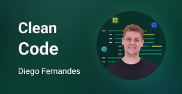

# Clean code 

<a href="./LICENSE.md">
    
</a>

</br>

<center>
    
</center>

[Click here to see the design](https://www.figma.com/community/file/1113573231685349036/Ignite-Feed) you need to have an account on [Figma](https://www.figma.com/).

## 💻 About this project

This repo contains 8 solved challenges from the Clean Code course provided by [@Rocketseat](https://rocketseat.com.br). During the course I could learn more about principles like: domain driven design and solid using NodeJS. Besides that, I could learn more about clean code patterns using ReactJS and TypeScript.

I'll be happy if you could send me any feedback about the project, code, structure or anything that you can report that could make me better as a developer!

And you can use this project as you wish!

## :octocat: Cloning repo

```bash
    $ git clone https://github.com/bw3sley/ignite-clean-code-challenges.git

    $ cd ignite-clean-code-challenges 
```

## 📩 Reach me out

You can reach me at:

Reach me at: bw3sley@gmail.com

Connect with me at [LinkedIn](https://www.linkedin.com/in/bw3sley)

## 📝 License

This project is licensed under the MIT License - see the [LICENSE.md](./LICENSE.md) file for details.